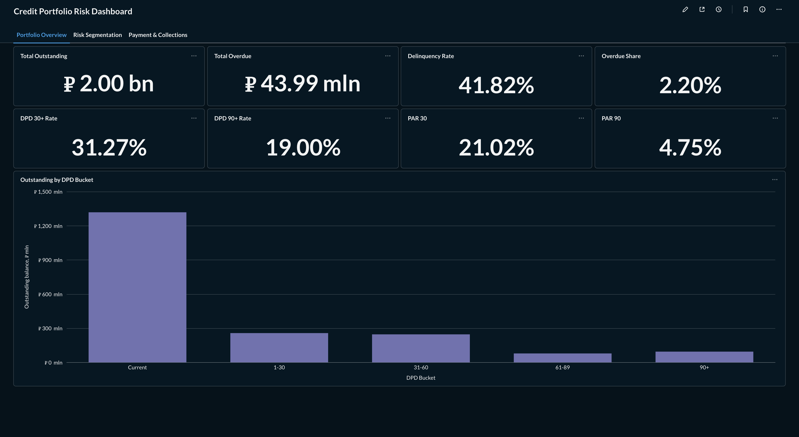
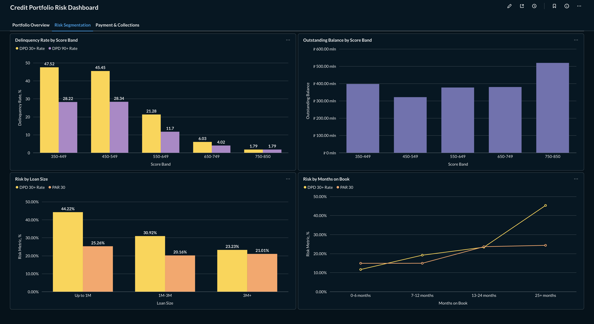
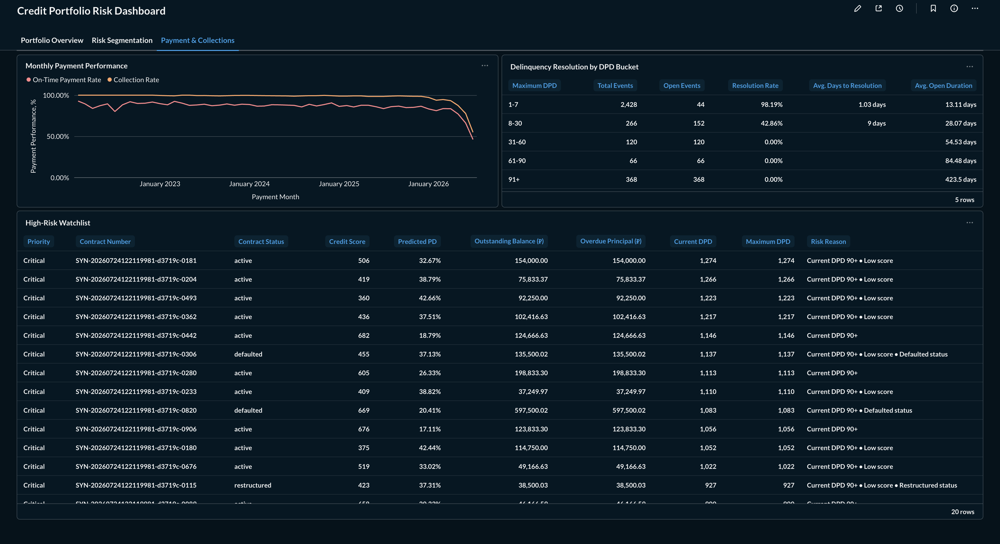

# Credit Portfolio Risk Analytics


An end-to-end credit portfolio analytics project built with PostgreSQL and Metabase.

The project covers the full analytical workflow: designing a relational lending model, generating a reproducible synthetic portfolio, building a contract-level data mart, calculating credit risk metrics and presenting the results in an operational dashboard.

## Dashboard

The Metabase dashboard is divided into three tabs:

1. **Portfolio Overview** — exposure, delinquency and Portfolio at Risk metrics;
2. **Risk Segmentation** — risk by application score, loan size and months on book;
3. **Payment & Collections** — payment performance, delinquency resolution and a high-risk contract watchlist.

The dashboard itself was built locally in Metabase. Its underlying SQL queries are version-controlled in this repository.

### Portfolio Overview



### Risk Segmentation



### Payment & Collections



A concise interpretation of the results is available in [Portfolio Findings](docs/portfolio_findings.md).

## Portfolio snapshot

Current portfolio metrics include active, defaulted and restructured contracts. Closed contracts are excluded.

| Metric | Value |
|---|---:|
| Total outstanding | ₽2.00 bn |
| Total overdue | ₽43.99 mln |
| Delinquency rate | 41.82% |
| DPD 30+ rate | 31.27% |
| DPD 90+ rate | 19.00% |
| PAR 30 | 21.02% |
| PAR 90 | 4.75% |
| Overdue share | 2.20% |

The following definitions are used consistently:

- **DPD 30+**: `current_dpd >= 30`;
- **DPD 90+**: `current_dpd >= 90`;
- **PAR 30**: share of outstanding principal associated with DPD 30+ contracts;
- **PAR 90**: share of outstanding principal associated with DPD 90+ contracts.

## Key findings

- Severe delinquency affects a larger share of contracts than of outstanding exposure: the DPD 90+ rate is 19.00%, while PAR 90 is 4.75%.
- Contracts with application scores below 550 have the highest concentration of DPD 30+ and DPD 90+.
- Loans up to ₽1 million have the highest DPD 30+ rate, while differences in PAR 30 between loan-size segments are smaller.
- The resolution rate falls from 98.19% in the 1–7 DPD bucket to 42.86% in the 8–30 DPD bucket.
- Historical collection rates are generally higher than on-time payment rates, meaning that some late payments are eventually collected.

These results are based on synthetic data and reflect the behavioural rules used by the portfolio generator.

## What the project includes

- a relational data model for customers, income, applications, scoring, decisions, contracts, collateral, disbursements, payment schedules, payments and delinquency events;
- a reproducible generator for 1,000 synthetic customers and loan contracts;
- a reusable analytical mart with one row per loan contract;
- portfolio monitoring and Portfolio at Risk metrics;
- risk segmentation by score band, original loan size and months on book;
- monthly payment-performance analysis;
- delinquency-resolution analysis;
- a prioritised high-risk contract watchlist;
- data-quality checks for mart completeness, grain and balance consistency;
- a three-tab Metabase dashboard.

## Core analytical mart

`portfolio_snapshot` is the main analytical view used throughout the project.

Its grain is **one row per loan contract**. It combines contract, payment and delinquency data and calculates:

- original principal;
- paid principal;
- outstanding principal;
- overdue principal;
- current DPD;
- maximum historical DPD;
- current DPD bucket;
- contract status.

Analytical reports use this mart instead of repeating contract-level calculations.

## Analysis areas

### Portfolio monitoring

Portfolio-level reports calculate:

- total outstanding and overdue principal;
- delinquent contract counts;
- delinquency rate;
- DPD 30+ and DPD 90+ rates;
- PAR 30 and PAR 90;
- overdue share;
- exposure by DPD bucket.

### Risk segmentation

Risk is compared across:

- application score bands;
- original loan-size segments;
- months-on-book segments.

The reports combine contract-level delinquency rates with balance-weighted measures.

### Payment behaviour

Payment analysis includes:

- scheduled and paid instalments;
- on-time payment rate;
- collection rate;
- average payment delay;
- delinquency resolution by maximum DPD;
- open-event duration.

### High-risk watchlist

The watchlist includes non-closed contracts with:

- current DPD of 30 or more;
- defaulted status;
- restructured status.

Contracts are ranked as Critical, High or Medium using current DPD and contract status.

## Project structure

```text
.
├── docs/
│   ├── dashboard/
│   │   ├── portfolio_overview.png
│   │   ├── risk_segmentation.png
│   │   └── payment_collections.png
│   └── portfolio_findings.md
└── sql/
    ├── 01_schema.sql
    ├── 02_generate_synthetic_portfolio_1000.sql
    ├── marts/
    │   └── portfolio_snapshot.sql
    ├── analytics/
    │   ├── portfolio_monitoring/
    │   ├── risk_segmentation/
    │   └── payment_behaviour/
    └── data_quality/
```

## Running locally

The project requires PostgreSQL.

Create and populate the database:

```bash
createdb credit_portfolio_risk

psql -d credit_portfolio_risk -v ON_ERROR_STOP=1 \
  -f sql/01_schema.sql \
  -f sql/02_generate_synthetic_portfolio_1000.sql \
  -f sql/marts/portfolio_snapshot.sql
```

Run an analytical report:

```bash
psql -d credit_portfolio_risk \
  -c "SET search_path TO credit_portfolio, public;" \
  -f sql/analytics/portfolio_monitoring/portfolio_kpis.sql
```

The generator does not delete existing records. Each execution adds a new synthetic portfolio batch.

## Data and limitations

- The dataset is entirely synthetic and contains no real customer data.
- Payment behaviour follows predefined generator rules.
- The analysis represents a current portfolio snapshot rather than a history of periodic snapshots.
- Recent payment months have shorter observation windows than older periods.
- The project does not currently estimate expected credit loss, loss given default or post-default recovery.
